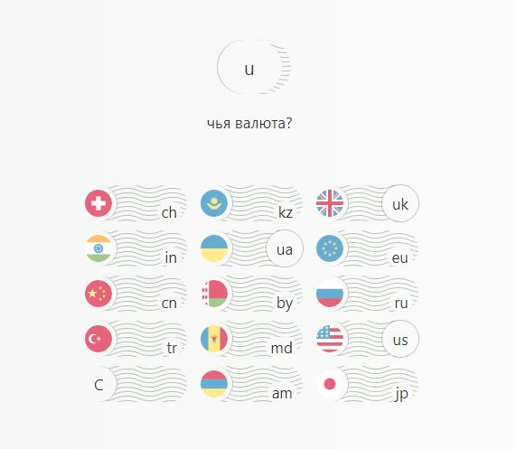

# Coin & coins
«Коин энд коинс» — конвертирует доллар, евро, фунт, рубли, йену, юань, гривну, тенге, франк, рупий, лею, драм и лиру в доллар, евро, фунт, рубли, йену, юань, гривну, тенге, франк, рупий, лею, драм и лиру в любых количествах и за любую дату из последних семнадцати лет.

Демо: [kukaew.github.io/cc](https://kukaew.github.io/cc/)

Набирайте с клавиатуры домены стран, к примеру: 

  **usru** = *доллар США в российских рублях;*
  
  **cc** = *отчистить;*
  
  **23.56uacn** = *23 гривны 56 копеек в юанях;*
  
  **сс**
  
  **23.56uacnmdtr** = *23 гривны 56 копеек в юанях, молдавских леях и турецких лирах;*
  
  **dd** = дата
  
  **230203chjp** = *швейцарский франк в йенах 23-го февраля 2003 года;*
  
  **dd**
  
  **080317200kzinam** = *200 тенге в рупиях и драмах на 8-го марта 2017 года;*
  
  **cp** = *скопировать ссылку на результат в буфер обмена, чтоб сохранить ссылку и больше не набирать; (или клик по котировкам)* 
  
  и т.д.
  
Кнопки-столбики монет помогут вспомнить домены стран, выделяясь в процессе набора:

После каждой набранной валюты видим её динамику с последних торгов, или с текущей даты к дате запроса, с учтём выходных и времени публикации котировок ЦБРФ (14:00 по Москве, примерно).

Можно набирать в адресной строке (в хэш-части URL), разделив *дату* и *количество* двоеточием: **#080317:200kzinam**.
 
Это волшебно, 'по-хакерски', что побуждает.

## Всё тоже самое удобно делать с телефона кликами кнопок!

**!** Данные **демо**нстрационные. Нужно заменить функцию '*cursArr*' в *js.min.js* на закомментированный код (там же), разместить файлы на сервер с PHP для выполнения '*curs.php*' и подменить им *curs.json* в '*.htaccess*':

 *RewriteRule ^curs\.json$ /curs.php [L]* (не забудьте про '*RewriteEngine on*'!)
 
'*curs.php*' вставляет '*.json*' за нужную дату, а если его нет, то берет '*.xml*' с сайта ЦБРФ и сохраняет его как '*.json*'.

Рабочий вариант: [cc.rewww.ru](http://cc.rewww.ru/)

